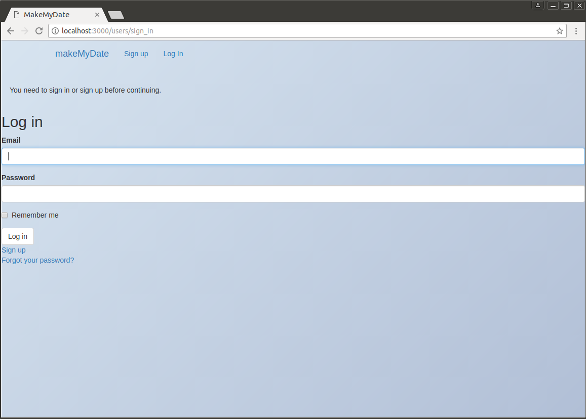
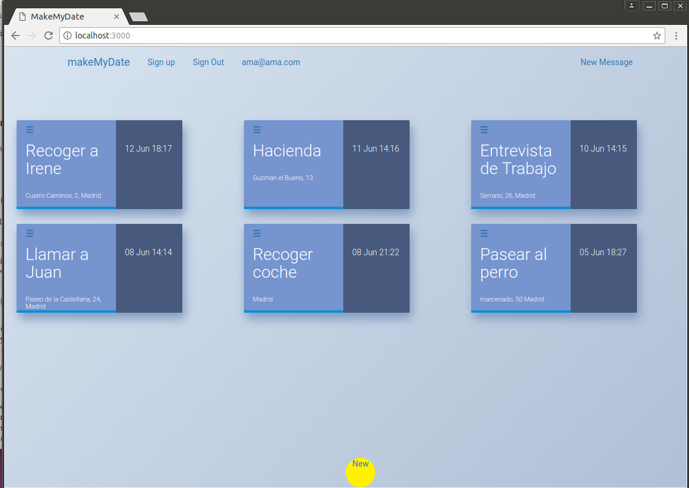
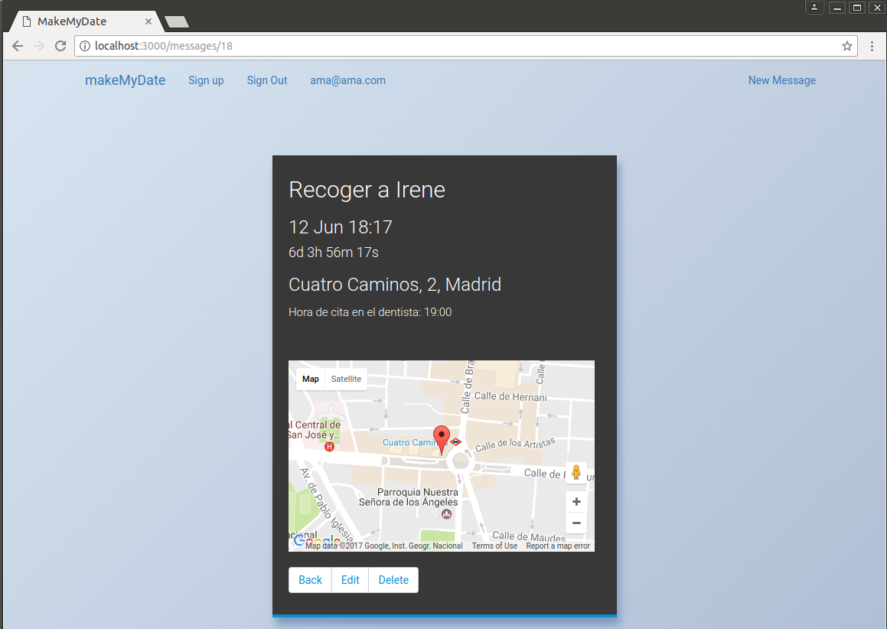

Welcome to Make my Date!
===================

Im actually developing Make my Date!, a Ruby on Rails app that helps you to remind your dates an their locations with Google Maps.

----------

How it works!
-------------

- Enter the title, hour and details of your date.
- Enter the location of the date

> **Note:**

> - You need to insert your Google Maps API Key in order to work.
> - Your can ask Google to send you one [here][1]

### Screenshots

  

  [1]: https://developers.google.com/maps/documentation/javascript/get-api-key